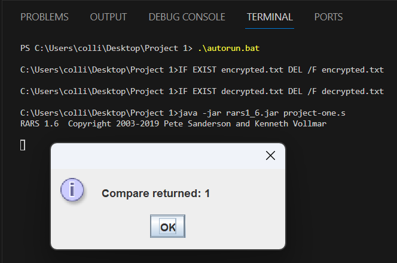

# ECE331 Project 1

Collin Delsignore (Spire ID: 30800923)  
University of Massachusetts - Amherst, Fall 2023 (Yadi Eslami)


## Dependencies

[Java Runtime Environment](https://www.java.com/en/download/manual.jsp) (ver 8.0+)
## Running the Program

On windows machines, simply double click the included autorun.bat file or run it through the CLI. It will automatically delete the old encrypted.txt and decrypted.txt files prior to running the assembly code.

```bash
  ./autorun.bat
```

For other systems, navigate to the project directory and run the program directly. You may manually delete the old encrypted.txt and decrypted.txt files if you wish, but it is not mandatory.

```bash
  java -jar rars1_6.jar project-one.s
```

The program will generate a popup window displaying the result of COMPARE if the program runs without error. You may view the contents of the generated encrypted.txt and decrypted.txt files for verification.

## Decryption Algorithm

XOR'ing and swapping nibbles are both reversable operations. Furthermore, during a swap the 0th byte becomes the 4th byte and vice versa. Therefore, the zeroing operation is agnostic of any swapping since it always targets bits 0 and 4. For that reason my program only calculates the zeroed characters once at the very start instead of with each iteration.  

The result is that even though I included a DECRYPT process in my program for clarity, you can actually just change the parameters of ENCRYPT and get the same effect. At first I thought it would have to happen in reverse order, but it doesn't. By zeroing the 0th and 4th bits of each byte in the password char, we know that the XOR process will preserve the information about whether or not a swap took place (since we check both 0 AND both 1).


## Documented Output

Given that this is an encryption project, I opted to not print the ascii processing in the console using `ecall` and to limit the buffer to 4 characters at a time instead of holding the entire file in memory (as I did in my original attempts in my [Piazza Post](https://piazza.com/class/llqz6bjf9e41ir/post/68)).  

Here I include a screenshot showing the program output. The compare function returns 1 indicating that the decrypted text exactly matches the encrypted text. While the program overwrites the files, preventing tampering, I did test the algorithm and verified that it does detect mismatched input (which never occurs in the normal operation of this program) either by differing characters or differing lengths.



Here I show the contents of the three files after running the program. Interestingly, there seems to be some newline characters as part of the encrypted text. Of course, they're just ascii like any other character so the program handles it fine. I encourage the grader to run the program and verify these screenshots.


## Acknowledgements

This program was originally written for the [Venus Simulator](https://github.com/ThaumicMekanism/venus), but after combing through the backend source code, it appears that the implementation of the FileWrite `ecall` is flawed. All calls return the expected (non-error) response, but after flushing and/or closing the file, no changes are reflected. Nonetheless, I credit Venus for my discovery of `ecall` functionality which made this project possible.

Then the program was rewritten for [RARS Simulator](https://github.com/TheThirdOne/rars) which had exhaustive support for robust `ecall` routines. Thanks to an anonymous poster mentioning it on my Piazza note, I was able to implement file writing on this new platform.